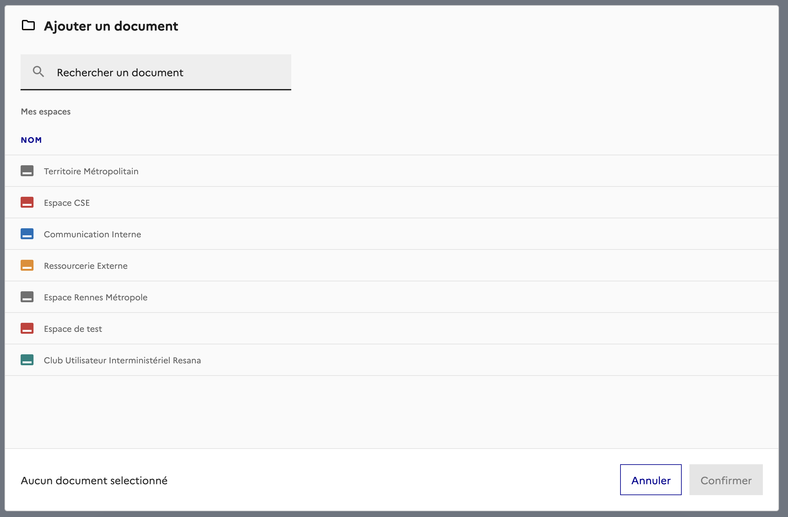
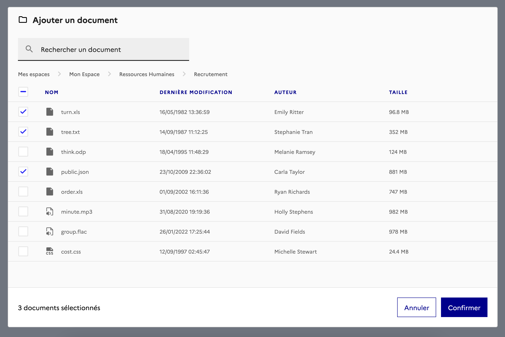
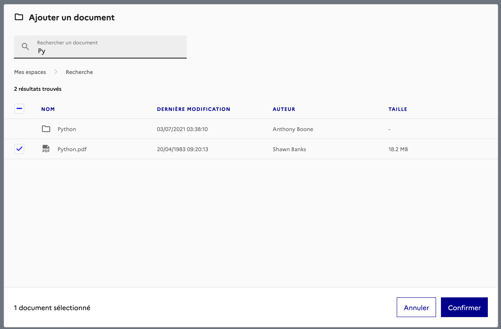

<div align="center">

# 🗂️ Widged SDK

🏗️ Work in progress ...

**Easily open a widget to browse user files on any of your project**



**As simple as**
</div>

```ts
const client = new WidgedClient();
client.pickFile({
  maxFiles: 3,
  onSelection: (files) => {
    console.log('Selected files', files);
  },
});
```


## Use case

This project aims to provide a simple way to open a widget to browse user files on any of your project. It is first intented
to be used to browse [Resana](https://resana.numerique.gouv.fr/) files but can be easily extended to support other services.

Let's say you are an authorized service provider and you want to allow your user to import their personnal
files from Resana. You can use this SDK to open a widget that will allow your user to browse their files and select the ones they want to import.


## ✨Features

<div align="center">

### 👥 Browse your workspaces


</div>

<div align="center">

### 🗂️ Browse your folders



</div>

<div align="center">

### 🔎 Search



</div>

## Contributing

This project is intended to be community-driven, so please, do not hesitate to
get in touch if you have any question related to our implementation or design
decisions.

🏗️ Work in progress ...

## License

This work is released under the MIT License (see [LICENSE](./LICENSE)).
